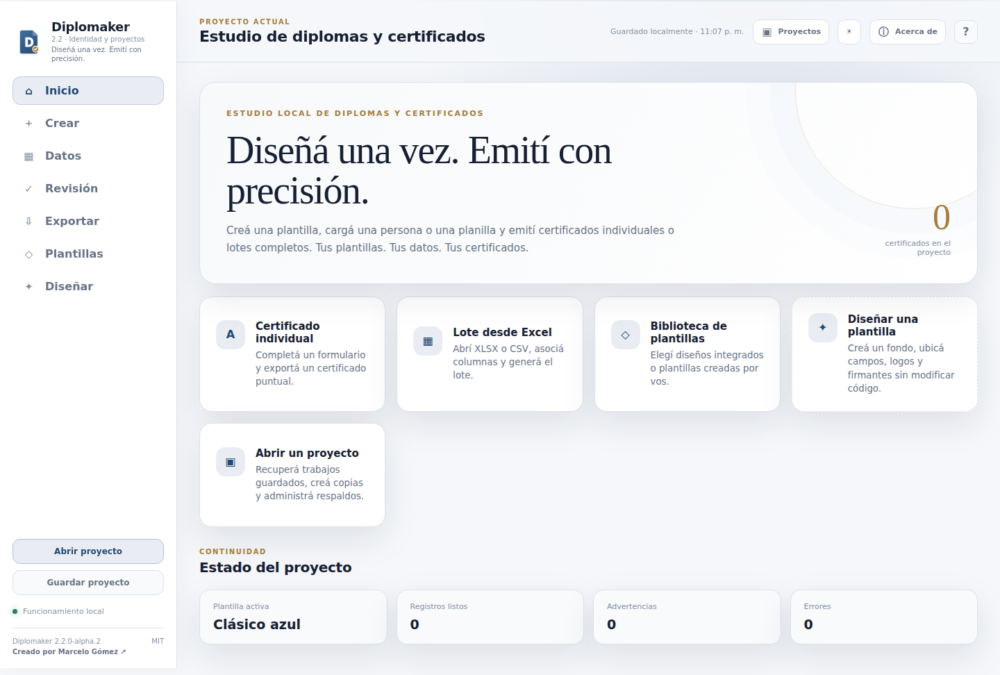
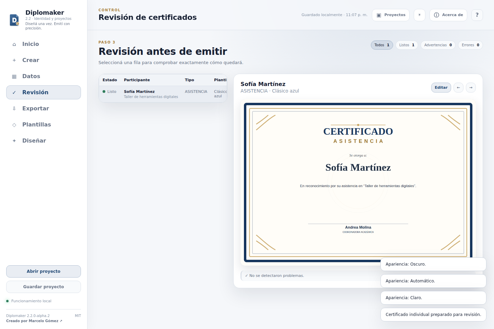
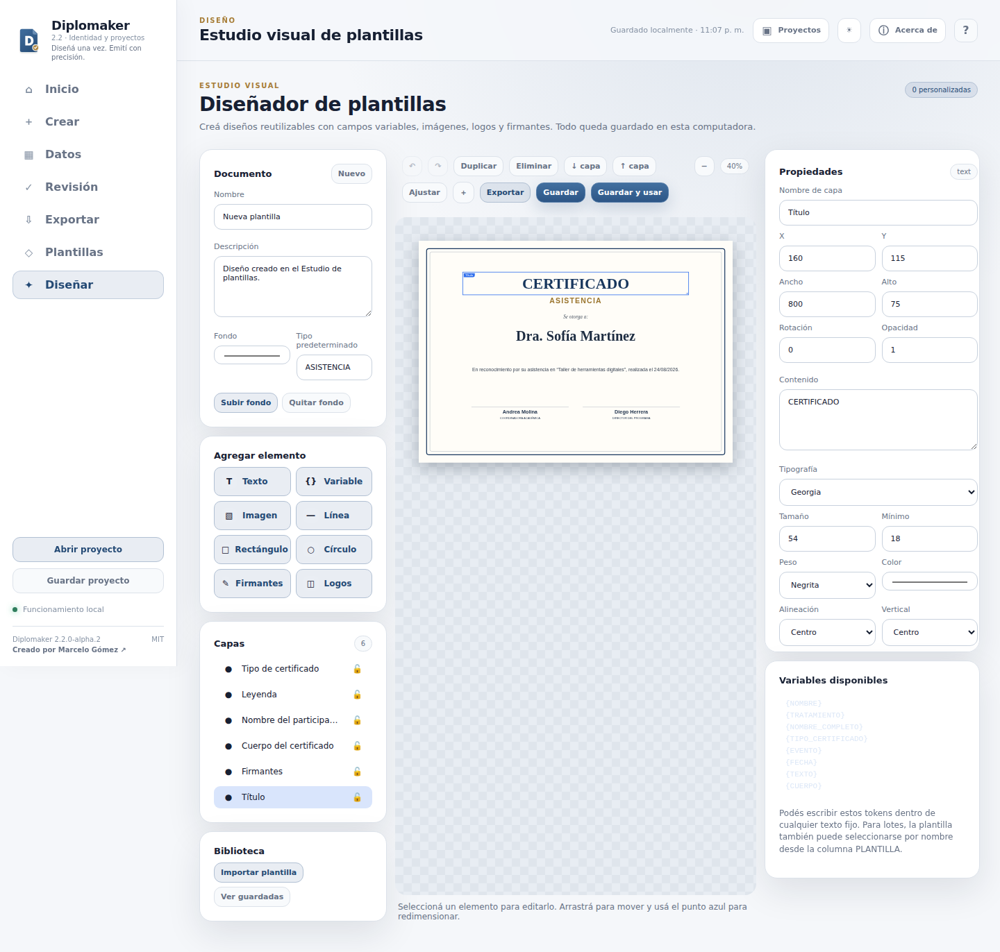
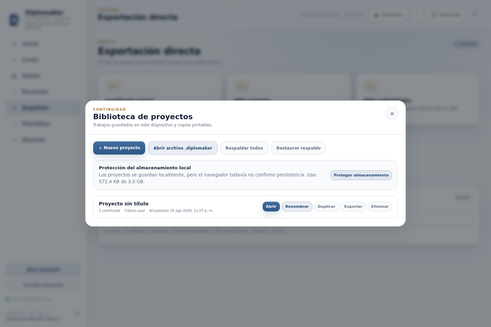
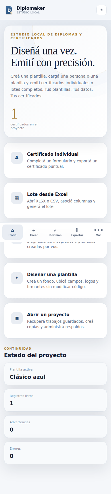
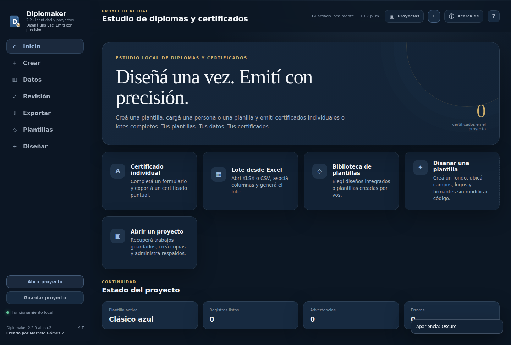
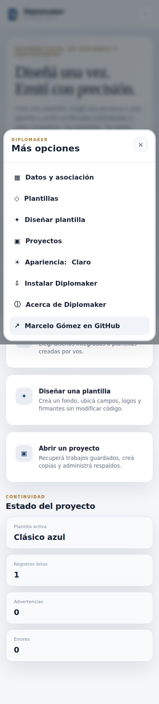

<p align="center">
  
</p>

<h2 align="center">Diseñá una vez. Emití con precisión.</h2>

<p align="center">
  Estudio local y de código abierto para diseñar plantillas reutilizables y emitir diplomas o certificados individuales y por lote.
</p>

<p align="center">
  <a href="https://sinergiaestudio.github.io/diplomaker/"><strong>Usar Diplomaker 2.1 estable</strong></a>
  ·
  <a href="https://github.com/sinergiaestudio/diplomaker/releases/tag/v2.2.0-alpha.2"><strong>Probar Diplomaker 2.2 alpha</strong></a>
  ·
  <a href="docs/INSTALLATION.md">Instalación</a>
  ·
  <a href="docs/ESTUDIO_DE_PLANTILLAS.md">Estudio de plantillas</a>
  ·
  <a href="PRIVACY.md">Privacidad</a>
</p>

<p align="center">
  
  
  
  
</p>

---

## Qué es Diplomaker

Diplomaker reúne en una sola herramienta dos recorridos que suelen estar separados:

1. **diseñar una plantilla** mediante un editor visual, sin modificar código;
2. **emitir documentos** para una persona o para cientos de registros importados desde Excel o CSV.

La vista previa y los archivos finales utilizan el mismo motor de composición. Los nombres, planillas, logos, firmas, plantillas y proyectos se procesan en el dispositivo del usuario.

> **Tus plantillas. Tus datos. Tus certificados.**

## Vista general

<p align="center">
  
</p>

<table>
  <tr>
    <td width="50%"></td>
    <td width="50%"></td>
  </tr>
  <tr>
    <td width="50%"></td>
    <td width="50%"></td>
  </tr>
</table>

<details>
  <summary><strong>Ver tema oscuro y menú móvil</strong></summary>
  <br>
  <table>
    <tr>
      <td width="72%"></td>
      <td width="28%"></td>
    </tr>
  </table>
</details>

Las capturas anteriores fueron producidas por la [prueba integral automatizada](docs/screenshots/ui-results.json), que también verifica creación, previsualización, PDF, ZIP, proyectos, temas, Estudio de Plantillas y navegación móvil.

## Funciones principales

### Generación

- certificado individual;
- lotes desde XLSX o CSV;
- detección y asociación de columnas;
- edición y revisión previa;
- advertencias por texto extenso, datos faltantes o archivos repetidos;
- firmantes variables;
- PDF individual y PDF conjunto;
- ZIP con un PDF por participante;
- PNG de alta resolución;
- informe CSV de emisión.

### Estudio visual de plantillas

- lienzo A4 apaisado;
- fondo en PNG, JPG, WebP o SVG;
- textos fijos y campos variables;
- imágenes, logos, sellos y firmas gráficas;
- líneas, rectángulos y círculos;
- bloques dinámicos de firmantes;
- distribución automática de logos;
- arrastre, redimensionado, rotación y opacidad;
- capas, bloqueo y ocultamiento;
- deshacer, rehacer y duplicar;
- exportación e importación `.diplomaker-template`;
- migración básica de plantillas creadas con la versión HTML 1.4.

### Proyectos y continuidad

- guardado automático en IndexedDB;
- biblioteca local de proyectos;
- renombrado, duplicado, exportación y eliminación;
- respaldo conjunto en ZIP;
- restauración de respaldos;
- proyectos portables `.diplomaker`;
- solicitud de almacenamiento persistente en navegadores compatibles;
- en la edición de escritorio, réplica automática en `Documentos/Diplomaker/Proyectos`.

### Apariencia e instalación

- tema claro predeterminado;
- tema oscuro alternativo;
- modo automático según el sistema;
- navegación móvil específica;
- instalación como PWA desde Chrome o Edge;
- funcionamiento offline después de la primera carga;
- edición de escritorio para Windows basada en Tauri.

## Plantillas públicas integradas

| Plantilla | Características |
|---|---|
| **Clásico azul** | Azul, dorado y marfil; composición ceremonial. |
| **Moderno bordó** | Geometría contemporánea en bordó y gris. |
| **Académico verde** | Verde, dorado y marfil; presentación sobria. |

Las plantillas públicas no incluyen marcas, autoridades ni identidades de terceros. Cada organización puede importar localmente sus propios fondos, logos y archivos `.diplomaker-template` sin incorporarlos al repositorio.

## Flujo de trabajo

```text
Plantilla → Datos → Revisión → Exportación
```

1. Elegir un diseño integrado o crear uno desde **Diseñar**.
2. Completar una persona o abrir una planilla XLSX/CSV.
3. Confirmar la asociación de columnas.
4. Revisar nombres, textos, logos y firmantes.
5. Exportar PDF, PNG, ZIP o informe.

## Formatos

### Entrada

- `.xlsx`;
- `.csv`;
- `.diplomaker`;
- `.diplomaker-template`;
- PNG, JPG, WebP y SVG para recursos gráficos.

### Salida

- PDF individual;
- PDF conjunto;
- ZIP de PDFs individuales;
- PNG;
- CSV de control;
- proyecto portable `.diplomaker`;
- plantilla portable `.diplomaker-template`.

## Privacidad

Diplomaker no requiere cuenta ni servidor para sus funciones principales. Los archivos se leen y procesan localmente. El repositorio público utiliza únicamente datos ficticios y recursos genéricos.

Consulte la [política de privacidad](PRIVACY.md) y el [aviso sobre recursos de terceros](NOTICE.md).

## Instalación

### Web y PWA

La versión pública estable continúa disponible en [GitHub Pages](https://sinergiaestudio.github.io/diplomaker/) mientras se valida la edición 2.2. En navegadores compatibles aparece el botón **Instalar** y la aplicación puede seguir utilizándose sin conexión después de la primera carga.

### Windows y versión 2.2 alpha

La [publicación de prueba 2.2.0-alpha.2](https://github.com/sinergiaestudio/diplomaker/releases/tag/v2.2.0-alpha.2) incluye:

- instalador Windows NSIS (`Setup.exe`);
- instalador Windows MSI;
- ejecutable portable para Windows x64;
- paquete web portable;
- archivo `SHA256SUMS.txt` para verificar la integridad.

Los instaladores alpha todavía no poseen firma de código. Windows SmartScreen puede mostrar una advertencia de editor desconocido; las huellas publicadas permiten comprobar que los archivos corresponden a la compilación generada por GitHub Actions.

Lea [Instalación y actualización](docs/INSTALLATION.md) y [Diplomaker Desktop](docs/DESKTOP.md).

## Desarrollo

Requisitos de la edición web:

```bash
npm run check
npm run serve
```

Para la edición de escritorio:

```bash
npm install
npm run desktop:dev
npm run desktop:build
```

La compilación genera automáticamente los íconos oficiales y prepara la carpeta `dist/` antes de invocar Tauri.

## Arquitectura

```text
Datos + Plantilla + Recursos
              ↓
       Motor de composición
        ↙             ↘
 Vista previa      PDF / PNG / ZIP
```

La versión web utiliza IndexedDB. La edición de escritorio conserva esa compatibilidad y agrega una capa de archivos locales, sin duplicar el frontend.

## Identidad

La marca combina un documento, la letra D y un sello de validación. El sistema completo, la paleta y las reglas de uso se documentan en [BRAND.md](docs/BRAND.md).

## Documentación

- [Identidad visual](docs/BRAND.md)
- [Instalación y actualizaciones](docs/INSTALLATION.md)
- [Proyectos y respaldos](docs/PROJECTS.md)
- [Diplomaker Desktop](docs/DESKTOP.md)
- [Estudio de plantillas](docs/ESTUDIO_DE_PLANTILLAS.md)
- [Arquitectura](docs/ARQUITECTURA.md)
- [Pruebas](docs/PRUEBAS.md)
- [Privacidad](PRIVACY.md)

## Autor y licencia

Creado por [Marcelo Gómez](https://github.com/sinergiaestudio).

Diplomaker se distribuye bajo [licencia MIT](LICENSE). Los logos, fondos, firmas y recursos que cada usuario incorpora conservan las condiciones de sus respectivos titulares.
